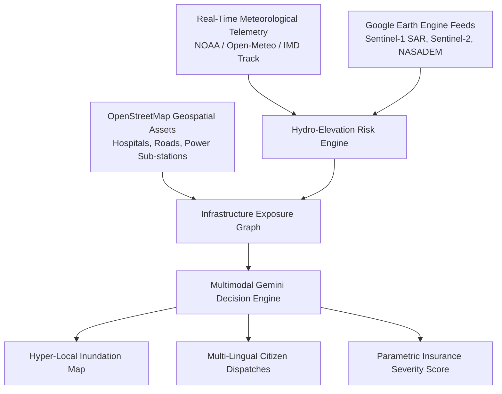

# 🌀 ResiliTrack AI — Cyclone Impact & Infrastructure Vulnerability Forecaster


> **ResiliTrack AI** is an AI-powered predictive risk and vulnerability modeling platform built for **Track 5: Cyclone Impact & Infrastructure Vulnerability Forecaster**. It shifts disaster management from reactive post-landfall recovery to **anticipatory pre-landfall action**, mapping hyper-local storm surges, critical infrastructure isolation risks, and automated multi-lingual emergency advisories.

---

## 🚨 The Problem Addressed
Extreme weather events in the Bay of Bengal and coastal APAC regions (e.g., Cyclones Amphan, Remal, Biparjoy) cause catastrophic loss of lives and infrastructure. 
- **Blind Spot**: Broad weather cones do not indicate if a specific hospital feeder road or power grid sub-station will be under 1.5m of water at 3 AM.
- **Cascading Failure**: Disaster commanders struggle to identify cut-off emergency shelters before flooding occurs.
- **Information Bottleneck**: Emergency officers receive raw satellite imagery without AI synthesis into immediate tactical actions.

---

## 💡 System Architecture



---

## ✨ Core Features

1. **🌊 Storm Surge & Hydro-Elevation Simulator**:
   Combines **NASADEM/SRTM DEM** elevation matrices from GEE with predicted wind speeds, barometric pressure, and 24h rainfall accumulation to generate flood depth overlays.
2. **🏥 Critical Infrastructure Exposure & Isolation Graph**:
   Extracts hospitals, power sub-stations, bridges, and evacuation centers from OpenStreetMap (OSM), calculating accessibility decay and flagging isolated trauma centers.
3. **🧠 Gemini Multimodal AI Operations Intelligence**:
   Feeds visual hazard maps + live telemetry to **Gemini** to produce structured executive reports, priority evacuation zones, and localized public alerts in **Bengali, Odia, Hindi, and English**.
4. **💳 Parametric Insurance Liquidity Score**:
   Computes pre-landfall severity indices to trigger instant disaster liquidity payouts prior to landfall.

---

## 📁 Repository Structure

```
ResiliTrack-AI-CycloneShield-/
├── app.py                      # Streamlit dark-themed command dashboard
├── gemini_engine.py            # Gemini Multimodal AI advisory & dispatch engine
├── gee_sim.py                  # Elevation hydro-dynamics & asset vulnerability model
├── gee_integration.py          # Native Google Earth Engine (ee) integration module
├── sample_cyclone_data.json    # Historical cyclone test data (Remal, Amphan, Biparjoy)
├── .streamlit/
│   └── config.toml             # Custom dark UI styling configuration
├── requirements.txt            # Dependencies
└── README.md                   # Project documentation & pitch guide
```

---

## 🚀 Quick Start & Installation

### 1. Clone Repository
```bash
git clone https://github.com/swatiicfai/ResiliTrack-AI-CycloneShield-.git
cd ResiliTrack-AI-CycloneShield-
```

### 2. Install Dependencies
```bash
pip install -r requirements.txt
```

### 3. Launch Dashboard
```bash
streamlit run app.py
```
*Navigate to `http://localhost:8501` in your browser.*

---

## 🔑 Environment Variables (Optional)

Set your Gemini API Key in your terminal or inside the Streamlit sidebar:
```bash
export GEMINI_API_KEY="your_api_key_here"
```
*(Note: If left blank, the platform automatically runs on its built-in simulated AI operational engine).*
