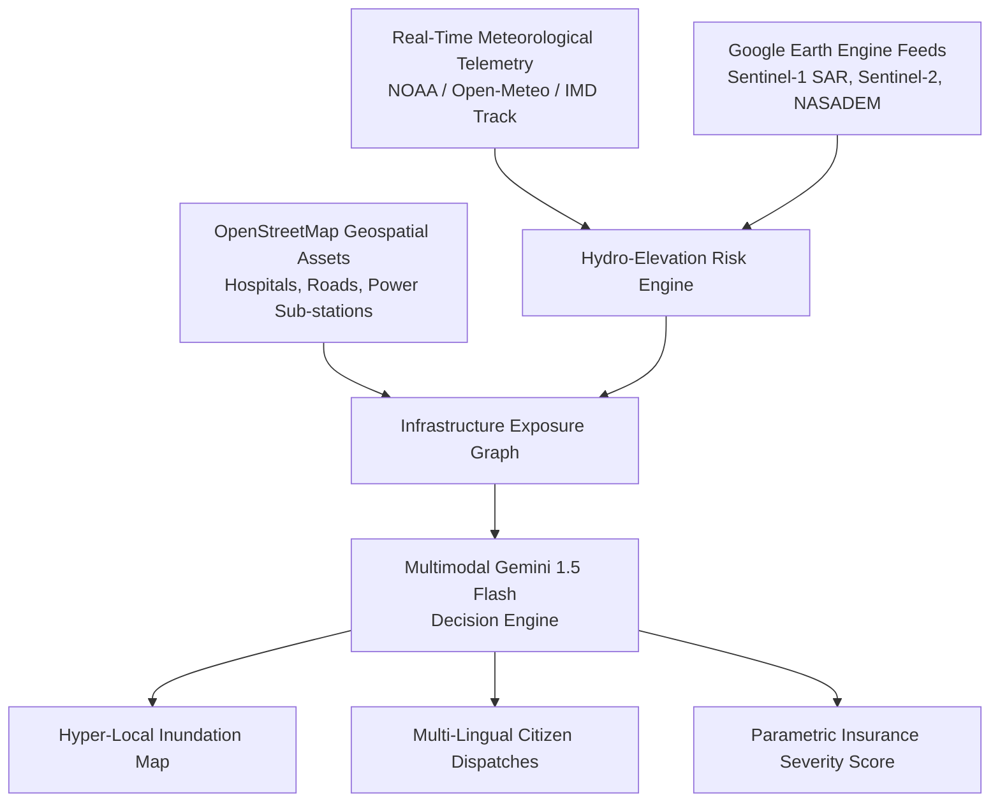

# 🌀 ResiliTrack AI — Cyclone Impact & Infrastructure Vulnerability Forecaster

<div align="center">

[](#)
[](#)
[](#)
[](#)
[](#)

**Build with AI: Code for Communities — 2nd Edition (Track 5)**

[🔴 Watch Demo Video (YouTube)](https://youtu.be/z19fyyGnFvo) &nbsp;&nbsp;|&nbsp;&nbsp; [🚀 Try Live Prototype (Streamlit)](https://efomw9k5jde5gwkxe3ybuj.streamlit.app/) &nbsp;&nbsp;|&nbsp;&nbsp; [📄 View Pitch Deck PDF](ResiliTrack_AI_Pitch_Deck.pdf)

</div>

> **ResiliTrack AI** is an anticipatory disaster intelligence platform built for **Track 5: Cyclone Impact & Infrastructure Vulnerability Forecaster**. It shifts disaster management from reactive post-landfall recovery to **proactive pre-landfall action**, mapping hyper-local storm surges, critical infrastructure isolation risks, and generating automated multi-lingual emergency advisories via **Gemini 1.5 Flash**.

---

## 🚨 The Problem Addressed
Extreme weather events in coastal regions cause catastrophic loss of lives and infrastructure. 
- **Blind Spot in Last-Mile Intelligence**: Broad weather cones do not indicate if a specific hospital feeder road or power grid sub-station will be under 1.5m of water at 3 AM.
- **Cascading Infrastructure Failure**: Disaster commanders struggle to identify cut-off emergency shelters before flooding occurs, making pre-positioning impossible.
- **Communication Bottleneck**: Emergency officers receive raw satellite imagery without AI synthesis into immediate tactical actions for frontline workers and citizens.

---

## 💡 The Solution

ResiliTrack AI solves this through 4 core pillars:

1. **🌊 Storm Surge & Hydro-Elevation Simulator**:
   Combines **NASADEM/SRTM DEM** elevation matrices from Google Earth Engine with predicted wind speeds, barometric pressure, and 24h rainfall accumulation to generate hyper-local flood depth overlays.
2. **🏥 Critical Infrastructure Exposure & Isolation Graph**:
   Extracts hospitals, power sub-stations, bridges, and evacuation centers from OpenStreetMap (OSM), calculating accessibility decay and flagging isolated trauma centers.
3. **🧠 Gemini Multimodal AI Operations Intelligence**:
   Feeds visual hazard maps and live telemetry to **Gemini 1.5 Flash** to produce structured executive reports, priority evacuation zones, and localized public alerts in **Bengali, Odia, Hindi, and English**.
4. **💳 Parametric Insurance Liquidity Score**:
   Computes pre-landfall severity indices to trigger instant disaster liquidity payouts prior to landfall.

---

## 🏗️ System Architecture



---

## 🚀 Quick Start & Installation

### 1. Clone Repository
```bash
git clone https://github.com/swatiicfai/ResiliTrack-AI-CycloneShield-.git
cd ResiliTrack-AI-CycloneShield-
```

### 2. Install Dependencies
```bash
pip install -r requirements.txt
```

### 3. Launch Dashboard
```bash
streamlit run app.py
```
*Navigate to `http://localhost:8501` in your browser.*

---

## 🐳 Docker Deployment

The application is fully containerized for easy deployment on Google Cloud Run or any Docker-compatible environment.

```bash
# Build the image
docker build -t resilitrack-ai .

# Run the container
docker run -p 8501:8501 resilitrack-ai
```

---

## 🔑 Environment Variables (Optional)

Set your Gemini API Key in your terminal or inside the Streamlit sidebar:
```bash
export GEMINI_API_KEY="your_api_key_here"
```
*(Note: If the key is left blank, the platform automatically runs on its built-in realistic simulation engine for demo purposes).*

---

## 📁 Repository Structure

```
ResiliTrack-AI-CycloneShield-/
├── app.py                      # Streamlit dark-themed command dashboard
├── gemini_engine.py            # Gemini Multimodal AI advisory & dispatch engine
├── gee_sim.py                  # Elevation hydro-dynamics & asset vulnerability model
├── generate_pdf.py             # Script to generate Pitch Deck PDF
├── Dockerfile                  # Containerization instructions
├── requirements.txt            # Dependencies
└── README.md                   # Project documentation
```

---
*Built with ❤️ for the Build with AI: Code for Communities Hackathon*
